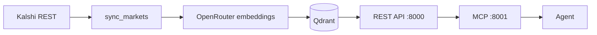

# openhedge

Open source experimental tool for discovering relevant hedges using event contracts and prediction markets.

It does not hold money or place trades. Any order happens on the source venue (today, [Kalshi](https://kalshi.com)).

## Hosted MCP

Install the public MCP from [openhedge.app](https://openhedge.app). The endpoint is `https://mcp.openhedge.app/mcp` (unauthenticated, rate limited). To self-host instead, use the Deploy on Railway button below.

## Inspiration

This project is inspired by [Blanket](https://tryblanket.app/) — a sharp, well-designed product that maps a small-business risk in plain language to live Kalshi markets, sizes a partial offset, and says so when nothing fits. Blanket found that fuel, fertilizer, weather, financing, and game-day promotions are real exposures, and that a prediction-market contract is sometimes a useful (if imperfect) proxy.

Blanket is independently published and powered by Kalshi. It does not hold money or place trades. openhedge is an open-source way to play with the same idea: ingest a catalog of binary event contracts, search it semantically, size a cash-flow hedge, and present the result — including an honest “none fits.”

## Point your agent at the skills

This repo ships Cursor agent skills. If you are using Cursor (or another agent that can follow a skill file), point it at these rather than improvising setup:

- [`.agents/skills/how-to-get-started/SKILL.md`](.agents/skills/how-to-get-started/SKILL.md) — install, `.env`, Docker Compose, health checks
- [`.agents/skills/how-to-deploy-to-railway/SKILL.md`](.agents/skills/how-to-deploy-to-railway/SKILL.md) — self-host on Railway: GitHub-sourced Qdrant, api, sync cron, private MCP, public Caddy
- [`.agents/skills/how-to-publish-railway-template/SKILL.md`](.agents/skills/how-to-publish-railway-template/SKILL.md) — generate and publish the marketplace template from that stack
- [`.agents/skills/how-to-add-cloudflare-tunnel/SKILL.md`](.agents/skills/how-to-add-cloudflare-tunnel/SKILL.md) — add-on: Cloudflare Tunnel in front of Caddy (custom domain, WAF, rate limits)
- [`.agents/skills/try-hedging-examples/SKILL.md`](.agents/skills/try-hedging-examples/SKILL.md) — connect MCP and run Blanket-style example prompts
- [`.agents/skills/how-to-deploy-landing/SKILL.md`](.agents/skills/how-to-deploy-landing/SKILL.md) — Next.js landing page on its own Railway project (`openhedge.app`)

[`AGENTS.md`](AGENTS.md) already tells agents to follow those skills.

## Deploy on Railway

One-click hosted stack (Qdrant, market sync, REST API, private MCP, public Caddy). You will be asked for an [OpenRouter](https://openrouter.ai/) API key (`OPENROUTER_API_KEY`).

[](https://railway.com/new/template/openhedge-1?utm_medium=integration&utm_source=button&utm_campaign=openhedge)

To self-host without the button, follow [`.agents/skills/how-to-deploy-to-railway/SKILL.md`](.agents/skills/how-to-deploy-to-railway/SKILL.md) or run Docker Compose locally.

The template creates five services:

| Service | Role | Public? |
| --- | --- | --- |
| `qdrant` | Vector store (`qdrant/qdrant:v1.19.0`, volume at `/qdrant/storage`) | No |
| `api` | REST API on port 8000 | No |
| `sync` | Kalshi ingest + embeddings (Railway cron, hourly) | No |
| `mcp` | Streamable HTTP MCP on port 8001 | No |
| `caddy` | Reverse proxy to `mcp` (streamable HTTP) | **Yes** |

Point an MCP client at `https://<caddy-domain>/mcp` (the Railway-generated domain on the `caddy` service). Example Cursor config:

```json
{
  "mcpServers": {
    "openhedge": {
      "url": "https://<caddy-domain>/mcp"
    }
  }
}
```

Railway runs `python -m openhedge_core.sync_markets` on an hourly cron (`0 * * * *`); the replica is down between runs. The first tick may wait until the next hour — the deploy skill runs one Railway Run now after creating `sync` (`deploymentInstanceExecutionCreate`; not `railway service redeploy`). `/v1/search` and MCP search stay empty until that pass finishes. Check `sync` logs for `open batch created=`; `GET /ready` on `api` (private) reports Qdrant and whether the embedder is configured.

Config-as-code for the GitHub-sourced services lives in [`deploy/railway/`](deploy/railway/). Caddy’s image is [`deploy/caddy/`](deploy/caddy/). There is no root `railway.toml` (that file would apply to every service).

### Showcase (Cloudflare Tunnel)

For a custom hostname with Cloudflare WAF / rate limits, follow [`.agents/skills/how-to-add-cloudflare-tunnel/SKILL.md`](.agents/skills/how-to-add-cloudflare-tunnel/SKILL.md) after the stack is up (deploy skill or one-click template). That add-on uses the same Caddy service: delete the Railway public domain on `caddy` (and `mcp` if one exists), deploy `cloudflared`, and point `mcp.<your-domain>` at `caddy.railway.internal:8080`. Do not leave a Railway public hostname on Caddy — it bypasses Cloudflare. Do not put `cloudflared` or `TUNNEL_TOKEN` in the published template.

### Publish the template (maintainers)

Follow [`.agents/skills/how-to-publish-railway-template/SKILL.md`](.agents/skills/how-to-publish-railway-template/SKILL.md) after the GitHub-sourced stack is up ([`.agents/skills/how-to-deploy-to-railway/SKILL.md`](.agents/skills/how-to-deploy-to-railway/SKILL.md)), without `cloudflared`. Qdrant is the Docker image `qdrant/qdrant:v1.19.0` with no API key (private only). After publish, put the template code in the Deploy button URL above (currently `openhedge-1`).

## Getting started

Requires [uv](https://docs.astral.sh/uv/), [Docker](https://docs.docker.com/), Python 3.12+, and an [OpenRouter](https://openrouter.ai/) API key (`OPENROUTER_API_KEY`) for market sync and search.

```bash
# uv
curl -LsSf https://astral.sh/uv/install.sh | sh

# pre-commit
uv tool install pre-commit
```

From the repo root:

```bash
uv sync --project openhedge-core
pre-commit install
cp .env.example .env
```

Fill `OPENROUTER_API_KEY` in `.env`. Do not commit `.env`.

Then start the stack:

```bash
docker compose up
```

Compose starts Qdrant, creates the collection, loops `sync_markets` (hourly by default), the REST API, and MCP.

| Service | URL |
| --- | --- |
| REST API | `http://localhost:8000/v1` |
| API health | `http://localhost:8000/health` |
| API ready | `http://localhost:8000/ready` |
| MCP (Streamable HTTP) | `http://localhost:8001/mcp` |
| MCP ready | `http://localhost:8001/ready` |

Example MCP client config (Cursor: `.cursor/mcp.json`):

```json
{
  "mcpServers": {
    "openhedge": {
      "url": "http://localhost:8001/mcp"
    }
  }
}
```

Do not add a `type` field. Reload MCP and confirm `openhedge` is connected.

Verify:

```bash
curl -sS http://localhost:8000/health
curl -sS http://localhost:8000/ready
curl -sS http://localhost:8001/ready
```

Without `OPENROUTER_API_KEY`, sync will not start and `/v1/search` returns 503.

## Try hedging examples

Once MCP is up, follow [`.agents/skills/try-hedging-examples/SKILL.md`](.agents/skills/try-hedging-examples/SKILL.md). Prefer the MCP `hedge_risk` prompt, or walk `search_markets` → `get_market` → `hedge` → `present_hedge`.

Example prompts (adapted from [Blanket’s casebook](https://tryblanket.app/#examples)):

**Sweden AI App Building Platform** (Sweden, AI compute)

> I run an AI app building platform in Stockholm, Sweden. NVIDIA H100 GPU hourly price above $2.75 could increase our inference cost by $1,000 next month.

Should find a good hedge as of 21/08/2026.

**Berlin Sports Bar** (Germany, sports)

> I run a bar in Berlin, Germany. If the Union Berlin win a Bundesliga match, I want to fund a customer offer; the promo could cost us about $1,000.

Should find a good hedge as of 21/08/2026.

**US Bowling Alley** (USA, electricity)

> I own a small bowling alley in Seattle, US. If electricity per kilowatt-hour exceeds $19.6, our operating costs would increase. Can I offset this risk?

Should find a good hedge as of 21/08/2026.

**London Trucking Company** (UK, fuel)

> I run a four-truck fleet in London, UK. Diesel above 1.81 GBP per litre could cost us about £5,000 this year.

Should not find a good hedge as Kalshi has market for US diesel in dollars per gallon that expire this month, same-day or month-end Brent and WTI strikes, and US gasoline year-highs, but those do not pay when UK fuel duty, VAT, wholesale, or sterling moves London pump prices independently of a US gallon or crude print.

openhedge does not place trades. Review live price, size, fees, eligibility, and rules on Kalshi before doing anything with a suggested market.

## How it works



### Ingest

A background sync pulls **active binary** Kalshi markets from the public REST API. Scalar markets are skipped; hedge math assumes a $1 / $0 payout.

For each new ticker, openhedge embeds a short text (event title plus Yes/No outcome labels) with OpenRouter `openai/text-embedding-3-small` (768 dimensions, cosine) and upserts the vector plus the full market payload into **Qdrant**. Later syncs refresh prices and other payload fields but do **not** re-embed. Closed, determined, or finalized markets are deleted from the collection.

Docker Compose re-runs sync every hour via [`openhedge-core/scripts/sync-loop.sh`](openhedge-core/scripts/sync-loop.sh) (`SYNC_INTERVAL_SECONDS=3600`). On Railway the same one-shot module is a cron job instead of a sleeping loop. `OPENROUTER_API_KEY` is required.

### Search

`POST /v1/search` embeds the query with the same model and returns nearest-neighbor markets from Qdrant (compact summaries: question, outcomes, prices/sizes, `end_datetime`, URL — not full resolution rules). Optional filters include category, tags, date ranges, and prices.

Structured lookup without a query:

- `GET /v1/markets` — filtered browse with cursor pagination
- `GET /v1/markets/{ticker}` — full record, including `description` (resolution rules)
- `GET /v1/events/{event_ticker}` — all markets in an event, ordered by strike
- `GET /v1/categories` and `GET /v1/tags` — popular filter values

Search is nearest-neighbor retrieval, not a guaranteed hedge. Without embeddings configured, search returns 503.

### MCP

The MCP server (`http://localhost:8001/mcp`) talks to the REST API, not Qdrant. Tools:

| Tool | Role |
| --- | --- |
| `search_markets` | Natural-language semantic search |
| `browse_markets` | Filtered browse with cursor pagination |
| `get_market` | Full market, including resolution rules |
| `get_event` | Strike ladder for one event |
| `list_categories` / `list_tags` | Popular filter values |
| `hedge` | Size a buy on one chosen ticker (does not search) |
| `present_hedge` | Format a sized candidate (or `verdict=none`) as a card |

Also exposed:

- Prompt **`hedge_risk`** — playbook: search → inspect rules → size → present
- Resource **`openhedge://docs/hedge-math`** — settlement and sizing formulas

Typical agent loop:

1. `search_markets` (or `browse_markets` / `get_event`)
2. `get_market` on shortlisted tickers; drop poor proxies
3. `hedge` once per kept ticker
4. `present_hedge` with `verdict=fit` (or `none` if nothing maps)

Honesty: state **basis risk** (for example hedging diesel with a crude-oil strike). Prefer an honest gap over a forced proxy.

## Hedge math

Only **binary** event contracts are supported. A contract on the chosen side pays **$1.00** if that side resolves and **$0.00** otherwise. Prices are in dollars in `[0, 1]` and are not snapped to cents (deci-cent books quote to 0.001). Contract counts snap to 0.01.

openhedge does not place orders. `hedge` sizes a **buy** at the stored top-of-book ask. It ignores Kalshi trade and rounding fees, so premium and net figures are slightly optimistic versus a real fill.

### Yes / No complement

The book is one pool viewed from two sides:

- YES ask + NO bid = 1.00
- YES bid + NO ask = 1.00
- Size at the YES ask equals size at the complementary NO bid
- Size at the YES bid equals size at the complementary NO ask

Buying YES at price `P` is the same exposure as selling NO at `1 - P`.

Kalshi’s orderbook is bids-only. A YES ask is the complement of the best NO bid. `hedge` uses only that stored top of book. It does not walk deeper levels for a VWAP premium.

- YES: `price = yes_ask_price`, `available_size = yes_ask_size`
- NO: `price = 1 - yes_bid_price`, `available_size = yes_bid_size`

### How `hedge` sizes a position

Discovery is separate. The agent chooses markets, then calls `hedge` once per ticker with optional `estimated_hit_dollars` and `coverage` (default 1.0).

If `estimated_hit_dollars` is set:

```
target_payout = estimated_hit_dollars * coverage
unconstrained_contracts = round(target_payout, 2)
contracts = min(unconstrained_contracts, round(available_size, 2))
premium = contracts * price
gross_payout = contracts          # each contract pays $1
net_if_pays = -estimated_hit_dollars + gross_payout - premium
net_if_expires = -premium
unhedged_hit_dollars = estimated_hit_dollars - gross_payout
coverage_achieved = gross_payout / estimated_hit_dollars
```

Negative values are net cash out. `net_if_pays` is signed P&L, not leftover hit. `hit − payout − premium` equals that P&L only when payout = hit. `unhedged_hit_dollars` is residual exposure (hit minus payout). `coverage_achieved` is payout versus modeled loss, not versus requested `coverage`. `liquidity_constrained` is true when top-of-book size is smaller than `unconstrained_contracts`. Size is capped at that quoted ask; remaining size is not filled at worse prices.

If no dollar hit is given, the same formulas run with `target_payout = $1` (unit economics). `net_if_pays`, `net_if_expires`, and `unhedged_hit_dollars` are omitted.

Each call is sized independently against the full hit. Overlapping contracts (same event, several strikes) can overstate coverage.

### Worked example

Suppose the modeled hit is **$10,000**, you want full coverage, and the best YES ask is **$0.20** with plenty of size:

| Quantity | Value |
| --- | --- |
| `target_payout` | $10,000 |
| `contracts` | 10,000.00 |
| `premium` | $2,000 |
| `gross_payout` | $10,000 |
| `coverage_achieved` | 1.0 |
| `unhedged_hit_dollars` | $0 |
| `net_if_pays` (event happens) | −$10,000 + $10,000 − $2,000 = **−$2,000** |
| `net_if_expires` (event does not) | **−$2,000** |

You pay $2,000 up front in both worlds. If the event happens, the $10,000 market payout offsets the $10,000 hit, and the leftover is the premium. If the event does not happen, you still spent the premium and the business hit did not land.

If the book only quoted 4,000 contracts, `liquidity_constrained` would be true, `contracts` would be 4,000, `gross_payout` $4,000, `coverage_achieved` 0.4, `unhedged_hit_dollars` $6,000, and `net_if_pays` −$6,000 − $800 premium = **−$6,800**.

### When none fits

Reject a candidate when the question, Yes/No outcomes, or resolution rules do not map cleanly to the exposure. Compact search hits omit `description`, `can_close_early`, and `early_close_condition` — fetch those with `get_market` before keeping a proxy. If `can_close_early` is true, trading can stop before `end_datetime`; keep the market only if that still covers the exposure window.

State basis risk explicitly. A crude-oil strike is not a diesel bill. A “none fits” card is a valid result, not a failure.

## Development

Lint, format, and types (ruff + mypy) are configured in [`openhedge-core/pyproject.toml`](openhedge-core/pyproject.toml). Prefer matching the pre-commit hooks:

```bash
uv run --project openhedge-core ruff format --config openhedge-core/pyproject.toml
uv run --project openhedge-core ruff check --fix --config openhedge-core/pyproject.toml
uv run --project openhedge-core mypy --config-file openhedge-core/pyproject.toml
```

```bash
pre-commit run --all-files
uv run --project openhedge-core pytest
```

Use `uv` exclusively from the repo root with `--project openhedge-core`. Never use pip, pip-tools, or poetry.

### Local modules without Compose

Only when developing a single service. Qdrant must already be on `http://localhost:6333`. Settings do not load `.env`; Compose does. Export env first:

```bash
set -a && source .env && set +a
```

Then, in order:

```bash
uv run --project openhedge-core python -m openhedge_core.setup_qdrant
uv run --project openhedge-core python -m openhedge_core.sync_markets
uv run --project openhedge-core python -m openhedge_core.server
uv run --project openhedge-core python -m openhedge_core.mcp_server
```


## Landing page

The landing page is a separate Next.js app in [`web/`](web/). Deploy it with [`.agents/skills/how-to-deploy-landing/SKILL.md`](.agents/skills/how-to-deploy-landing/SKILL.md) — never onto the OSS Railway project. It is for showcasing the MCP, not for self-hosting.
